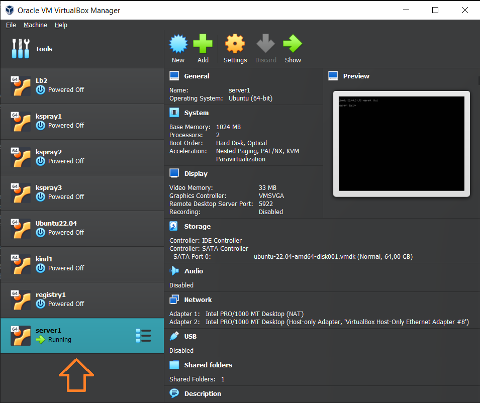

# Vagrant Provisioning

*Create* dan *Destroy* mesin virtual pada virtualbox secara instan menggunakan vagrant

## Install VirtualBox
Jika menggunakan Oracle VirtualBox, silahkan mengikuti petunjuk installasi https://www.virtualbox.org/wiki/Downloads

## Install Vagrant
Silahkan mengikuti petunjuk installasi vagrant https://developer.hashicorp.com/vagrant/install

```
$ vagrant --version
Vagrant 2.4.0
```

## Create virtual machine
https://app.vagrantup.com/boxes/search

Disini akan mencoba membuat dan menjalankan virtual box ubuntu server menggunakan vagrantbox `bento/ubuntu-22.04` dengan NetworkIp `10.104.10.200`
```
$ vagrant up
Bringing machine 'server1' up with 'virtualbox' provider...
==> server1: Importing base box 'bento/ubuntu-22.04'...
==> server1: Matching MAC address for NAT networking...
==> server1: Checking if box 'bento/ubuntu-22.04' version '202309.08.0' is up to date...
==> server1: Setting the name of the VM: server1
==> server1: Clearing any previously set network interfaces...
==> server1: Preparing network interfaces based on configuration...
    server1: Adapter 1: nat
    server1: Adapter 2: hostonly
...
```
tunggu beberapa saat, setelah proses installasi selesai pada virtualbox akan terlihat `vm` baru dengan nama `server1`



## Login ssh ke server
Untuk login ssh ke server, gunakan `root` password `P4ssw0rd` 
```
$ ssh root@10.104.10.200

root@10.104.10.200's password:
X11 forwarding request failed on channel 0
Welcome to Ubuntu 22.04.3 LTS (GNU/Linux 5.15.0-83-generic x86_64)

 * Documentation:  https://help.ubuntu.com
 * Management:     https://landscape.canonical.com
 * Support:        https://ubuntu.com/advantage

  System information as of Wed Mar  6 04:26:53 PM UTC 2024

  System load:  0.1611328125       Processes:             144
  Usage of /:   12.0% of 30.34GB   Users logged in:       0
  Memory usage: 25%                IPv4 address for eth0: 10.0.2.15
  Swap usage:   0%                 IPv4 address for eth1: 10.104.10.200


This system is built by the Bento project by Chef Software
More information can be found at https://github.com/chef/bento
Last login: Wed Mar  6 16:26:54 2024 from 10.104.10.1
root@server1:~#
```

## Destroy virtul machine
```
$ vagrant destroy -f
==> server1: Forcing shutdown of VM...
==> server1: Destroying VM and associated drives...
```

## References
https://github.com/justmeandopensource/kubernetes/tree/master/vagrant-provisioning